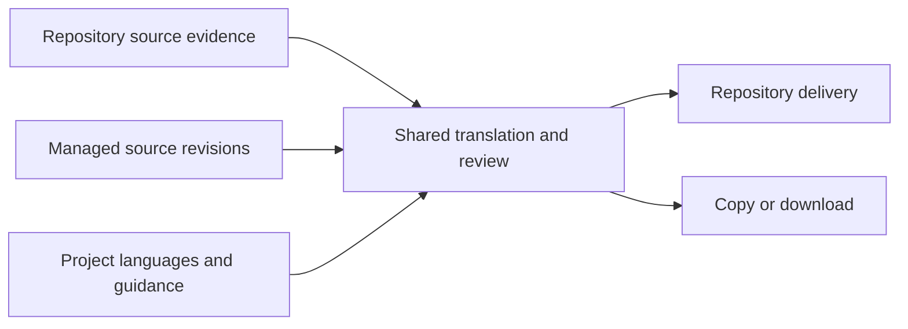

# Content beyond repository catalogs

Status: **proposed architecture; managed content is not implemented**.
Seryozha confirmed that marketing source text should be authored in Blabla and
reviewed translations copied or downloaded. MOC content currently lives in an
unspecified database; its connector is outside this design's implementation scope.

## Assessment

The current system fits repository-owned ARB content. It does not support
independently authored marketing copy through Strings, Translation Tasks, or
agent search. A Source Snapshot is catalog evidence from Git, not a screenshot;
visual context is optional and is not the obstacle.

| Current coupling | Evidence | Change needed |
| --- | --- | --- |
| One repository, Baseline and active projection per project | [Project schema](../../packages/backend/convex/schema.ts#L256), [active projection](../../packages/backend/convex/catalogProjection.ts#L2232) | Give independently owned content its own identity and source state |
| One catalog path on each project Locale | [Locale schema](../../packages/backend/convex/schema.ts#L337) | Separate language identity, collection membership, and repository binding |
| Source and target edits require existing projected rows; source edits propose Git changes | [Workspace commit](../../packages/backend/convex/catalogWorkspace.ts#L740) | Direct source authoring for managed content; retain repository proposals |
| Target edits, candidates and retrieval carry Snapshot/Git evidence | [Target read](../../packages/backend/convex/catalogWorkspaceRead.ts#L34), [candidate basis](../../packages/backend/convex/schema.ts#L137), [retrieval](../../packages/backend/convex/agentRetrieval.ts#L171) | Share translation decisions above origin-specific concurrency checks |
| New-language delivery assumes Flutter files and runtime mappings | [Introduction setup](../../packages/backend/convex/localeIntroductionTargets.ts#L51) | Managed language selection must not invoke repository delivery |
| Target validation always interprets ICU | [Contract validation](../../packages/backend/convex/contractTransforms.ts#L451) | Plain text must have an explicit non-executable contract |
| Empty Strings and project onboarding lead to repository setup | [Strings view](../../apps/web/src/components/localization/strings-catalog-view.tsx), [project creation](../../apps/web/src/routes/projects.new.tsx) | Let managed content start without a checkout |

The retained `translationKeys`, `translationValues`, and `translationHistory`
tables have no current authoring path. Reviving them would bring back a second
lifecycle. Removing their historical data is a separate retention decision.

## One project, independent collections

A **collection** is a named set of messages with one source owner, its own key
namespace, and selected target Locales. For example: App, App Store, Google Play,
or Screenshot copy. Separate collections are useful when wording, language
coverage, or delivery differs; equal text does not imply shared identity.

| Owner | Responsibility |
| --- | --- |
| Project | Members, permissions, Locale identities, general Voice Guide, Locale add-ons, Dictionary, and independent-review policy |
| Collection | Message namespace, target-Locale membership, source ownership, and content format |
| Shared translation workflow | Current values, source currency, exact confirmation, intentional blanks, candidate revisions, review, tasks, and search |
| Repository collection | Existing Snapshot ingestion, reconciliation, file bindings, Source Proposals, and repository Release Bundles |
| Managed collection | Directly authored source revisions, explicit archival, and copy/download output |

Keep the project's source Locale for the first implementation. Per-collection
source languages, nested collections, per-collection permissions, and additional
voice-guide hierarchies have no demonstrated requirement here.

The existing Localization Sync Module remains the repository lifecycle. It
should call shared translation policy where needed; managed authoring should
not call snapshot ingestion. A future database connector joins the source or
delivery side only after its authority and exchange contract are known.

### Identity and language membership

A message is addressed by collection and key. That identity must reach value
heads, confirmations, candidates, tasks, history, search results, URLs, cursors,
and draft/cache keys. Two collections may both contain `title` without sharing
edits or review evidence. Keep keys stable; initially a new key is a new message,
with explicit archive of the old one instead of automatic rename inference.

Locales remain project identities. Membership says which languages a collection
uses; repository bindings attach file paths to that membership. Selecting a
language for marketing neither activates it in the app nor changes app Release
Scope. Removing it from one collection cannot archive another collection's work
or the project Locale. Project-wide archival, code correction and deletion need collection-aware usage
checks before managed authoring ships. In particular, the current
[setup correction](../../packages/backend/convex/locales.ts#L349) may delete an
unbound Locale after checking only legacy values; absence of a catalog path
must no longer imply absence of content.

Regional language variants may have their own identities. File naming and
Flutter runtime mappings remain repository-specific; no automatic equivalence
between a language and its regional variants. No platform locale mapping is
needed merely to author or download marketing copy.

### Source and target decisions

Managed collections start with plain text. Preserve punctuation, line breaks,
and literal braces without ICU parsing or whitespace rewriting. Context is an
optional note; it does not require code references or images. Do not infer an
executable format from text. The existing ARB workflow keeps its ICU contract.

An editor creates a key and source text directly. Source edits create immutable
revisions and make translations answering different source content stale;
existing values and confirmations remain history. Context-only edits do not
change the Source Contract. Missing targets are Waiting. Saving or confirming a
target affirms the exact target and source, using the existing human/authorized
independent-agent rules. Managed creation does not invent Git import or First
Review provenance.

Keep the server's edit basis explicit and typed: repository values retain their
Git/projection/workspace evidence; managed values use source and target
revisions. The editor carries that basis back unchanged. Server validation
checks collection ownership, active membership, permissions, current basis and
content validity in the same transaction that applies a decision. Do not replace
these checks with a client-supplied revision that is trusted without lookup.

Agent candidates remain inert until review. A source edit, competing target
edit, archival, or membership removal invalidates an incompatible candidate.
The same review authorization and authorship evidence applies to both kinds of
collection; no separate marketing approval implementation. Direct source
authoring initially requires an editor. Existing translation-proposal credentials
must not acquire source-write authority merely because content is managed.

### One Strings experience

- With one collection, show its name without requiring a choice. With several,
  show a compact selector beside Strings. Preserve the existing App collection
  as the initial destination for existing projects.
- Keep the current source/target cards, keyboard saves, draft protection and
  multi-language selection. **All languages** means all enabled target languages
  in the selected collection, with bounded hydration as today.
- A managed collection offers **Add string** (key, source text, optional context),
  source editing and archival. Its empty state offers that action immediately.
- An app collection retains Sync and repository delivery. Source editing clearly
  proposes a change; managed source editing clearly saves it. Repository import
  controls and New from Git belong only to repository content.
- Project creation offers **Connect repository** or **Write content here**.
  Connection details live in the selected collection's settings. Keep source
  language labels dynamic; English is a default, not a global product rule.

A collection switch must preserve or explicitly resolve dirty drafts, reset
page cursors and selected task keys, and retain a valid language selection.
There is no combined editable All collections view in the first version.

### Search, tasks, and delivery

Search the selected collection by default. Allow deliberate project-wide example
lookup so agents can reuse established app terminology in marketing; every hit
must name its collection, Locale and confirmation/source evidence. Reviewed copy
from another surface is an example, never permission to overwrite the current
one. Keep existing literal search and its bounds; this change does not require
a new search engine. Exhaustive scans keep explicit continuation and freshness
semantics rather than silently loading every collection.

A task names one collection and a target Locale. Context, task creation,
submission and review must work without a Snapshot for managed content. Project
discovery needs to distinguish available project languages from collection
membership. Existing v1 repository endpoints and discovery retain App-scoped language
membership: marketing-only languages must neither appear usable to old repository
agents nor hide a valid App introduction target. New collection-aware calls must never default writes to whichever
collection was last viewed in the browser. Update portable skills when these
calls ship.

For marketing, copy one value or download explicitly selected keys and languages
as UTF-8 JSON first. Serve bounded selections from a consistent read of exact
source/value/review revisions; larger reads must pin and validate their basis,
restarting on change rather than mixing revisions. Reviewed downloads block on
selected missing, stale or unreviewed values unless the user explicitly chooses
partial output with an omission report, or a labelled draft download. Copying an
unresolved value is visibly a draft action. Do not add durable export records
or stored artifacts until asynchronous or reusable downloads need them.
Copying or downloading does not claim publication to a store. No Git Release
Record, Flutter generation or all-app-language gate is required for marketing
delivery.

## Implementation sequence and safeguards

1. **Simplify the existing Strings path.** Remove unused whole-catalog conversion
   and local filtering alternatives; keep server-filtered pages and bounded
   visible-card reads. Correct stale comments and source-language wording.
2. **Establish collection identity without changing repository behavior.** Give
   each existing project a default App collection. Scope operational heads,
   navigation, decisions, candidates and bindings to it. Add bounded, restartable
   backfill and compatibility reads before cutting over writers; verify counts
   and identities before removing the fallback. Preserve immutable historical
   records through an explicit legacy-to-App mapping rather than rewriting
   evidence. Preserve old app URLs and v1 repository scope.
3. **Ship managed content end to end.** Add source authoring and collection Locale
   membership, shared target reads/decisions, the existing editor, agent
   search/tasks/review, and copy/download. Extract common policy using these two
   real implementations. Keep repository projections as repository evidence;
   do not duplicate them into another universal message table just for naming
   symmetry. Move Git settings off the project only as their consumers migrate,
   with one authoritative writer at every step.
4. **Add a database adapter when specified.** Determine who owns source changes,
   stable IDs, revision/conflict behavior, deletions, and how reviewed values
   reach the consumer. Do not assume database content needs a Git manifest,
   polling, webhooks, or a live translation-serving API.

The principal cost is identity migration across reads, writes and retained
review evidence. The gain is independent content without duplicate translation
policy. Collection metadata is small; retained source and target revisions consume
storage proportional to actual content and history. Managed edits need no
whole-project snapshot or projection rebuild. Keep target values as indexed
per-message/per-Locale records and all scans/backfills bounded; do not introduce
one multilingual document per collection. Measure large workloads separately.

Focused local acceptance scenarios:

- Create, translate, review, search and download managed text with **no Snapshot**.
- Use the same key in App and App Store; edits, candidates, cursors and drafts
  remain isolated. App reconciliation and release never touch marketing.
- Add a marketing-only regional Locale; app bindings and release readiness stay
  unchanged. Removing one membership preserves other collections and history.
- Change source during editing/review/download: stale work cannot overwrite newer
  work or be reported as currently reviewed. Literal braces round-trip unchanged.
- Reject self-review and ungranted reviewer agents; accepting an authorized exact
  revision records the same provenance as repository translation review.
- Resume interrupted migration without duplicate collections or lost decisions;
  old URLs and repository clients still address App.

These scenarios can use small local fixtures. No hosted Convex seeding or
50-/100-language load test is needed for the architectural work.
